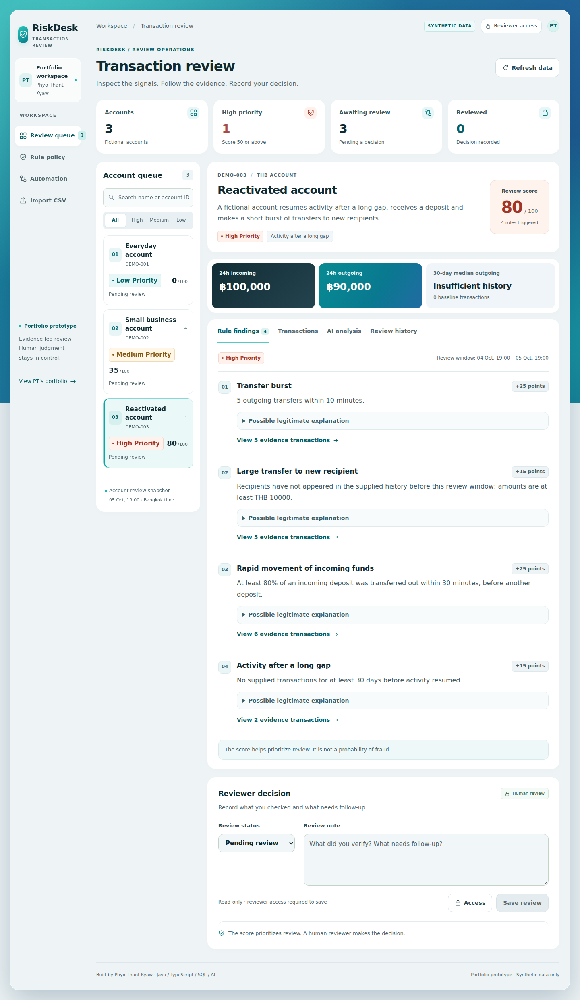

# Transaction Risk Review Assistant

A Java + TypeScript portfolio prototype by **Phyo Thant Kyaw (PT)**.



Explore fictional account histories, inspect configurable risk rules, generate optional AI explanations and record review decisions.

**Status:** runnable MVP. A public deployment, Supabase connection and live Gemini/n8n execution must be configured by the owner. No live URL is claimed in this source package.

## Included
- Spring Boot / Java 17 backend with five deterministic, configurable rules.
- React + TypeScript responsive review dashboard.
- Local H2 database without a separate database installation; Supabase PostgreSQL configuration and SQL setup included.
- Three synthetic scenarios with expected scores **0 / 35 / 80**.
- Optional Gemini structured explanations, safe rule-based fallback and a live-call rate limit.
- Validated fictional CSV imports with an independent review snapshot per account.
- Append-only review notes protected by a reviewer token.
- Docker multi-stage build and Render blueprint.
- n8n daily-digest workflow export (inactive until configured).
- Automated Java rule/API/provider tests and browser smoke-test instructions.

## Quick start on Windows

**Fastest route for the downloadable bundle:** it includes a built JAR. With Java 17+ installed, open PowerShell in the extracted project folder and run:

```powershell
powershell -ExecutionPolicy Bypass -File ./run-demo.ps1
```

This command runs only the included local startup script. No Node.js, Maven, Docker or Supabase setup is needed for this bundled demo. Open http://localhost:8080 after startup. The source-build steps below are for modifying/rebuilding the application.

Prerequisites: **JDK 17 or newer** and **Node.js 22 or newer**. Your Hadoop installation may use an older Java version; check `java -version` first. Use a separate JDK 17 installation for this project if needed. Do not change Hadoop's configuration just to run this app.

Extract the project and open PowerShell in its folder:

```powershell
cd frontend
npm ci
npm run build
cd ..
New-Item -ItemType Directory -Force src/main/resources/static | Out-Null
Copy-Item frontend/dist/* src/main/resources/static/ -Recurse -Force
$env:REVIEWER_TOKEN = "local-demo-reviewer-2026"
./mvnw.cmd verify
java -jar target/transaction-risk-review-0.2.0.jar
```

Open **http://localhost:8080**. Click the PT avatar, enter your configured reviewer token, then save a fictional review note. The example token is for local demo use only; generate a new random token for hosting.

The Java Maven Wrapper downloads Maven; no manual Maven install or Ubuntu/Docker installation is needed. Keep the backend process running while using localhost.

### Linux/macOS

```bash
cd frontend
npm ci
npm run build
cd ..
mkdir -p src/main/resources/static
cp -R frontend/dist/. src/main/resources/static/
./mvnw verify
REVIEWER_TOKEN=local-demo-reviewer-2026 java -jar target/transaction-risk-review-0.2.0.jar
```

### Development with hot reload
Backend terminal: `./mvnw spring-boot:run` (Windows: `./mvnw.cmd spring-boot:run`).
Frontend terminal: `cd frontend` then `npm run dev`.
Open the Vite URL printed in the terminal; its `/api` proxy calls localhost:8080.

## Import your own fictional scenario

1. Open **Import CSV** and download the sample, or use `samples/demo-transactions.csv`.
2. Enter a display name and select your CSV. Confirm that all values are fictional.
3. Click **Access** to enter your configured reviewer token, then **Import and review**.
4. The new account is selected automatically. The sample has expected score **80**.

Required columns: `transaction_id,occurred_at,direction,amount,counterparty,description`. Maximum **1 MB / 1,000 records**. IDs must be unique within the file; timestamps must include a timezone; directions are IN/OUT; amounts are positive THB decimals with up to two decimal places. Descriptions may be empty. Quoted commas and multiline text are supported.

One file creates one account; it does not append to an existing account. The latest imported timestamp sets that account's review cutoff. The full supplied history is retained, with the last 24 hours reviewed and the preceding 30 days used for the amount baseline. Re-uploading creates a separate account; cross-file duplicate detection is not implemented. Any rejected record rejects the entire file. Read-only visitors can see imported fictional data.

## Supabase

Use a dedicated demo project. Run **supabase/setup.sql** in its SQL editor. Tables live in the `risk_demo` schema and are accessed only by the server via JDBC, not directly by browser clients. Do not add this schema to the public Data API exposed schemas.

From Supabase **Connect**, use the **Session pooler** connection for an IPv4-hosted persistent Java server. Copy its actual host, port, username and database password. Use the database password, not a Supabase API key.

Set:
```text
DB_URL=jdbc:postgresql://YOUR_SESSION_POOLER_HOST:5432/postgres?sslmode=require
DB_USERNAME=postgres.YOUR_PROJECT_REF
DB_PASSWORD=<database password>
DB_INIT_MODE=never
```
The first start seeds the three scenarios if the accounts table is empty. It never deletes an existing dataset. Environment variables must be set in your terminal or host dashboard; Spring does not automatically load `.env` files.

## Live URL on Render

1. Push this folder to a new GitHub repository named `transaction-risk-review`.
2. Complete the Supabase SQL setup above.
3. In Render, create a **Blueprint** connected to the repository; it reads `render.yaml`.
4. Provide DB_URL, DB_USERNAME and DB_PASSWORD. Leave GEMINI_API_KEY empty to use rule-based explanations initially.
5. Render builds the Dockerfile in the cloud. No laptop Docker installation is required.
6. Wait for deployment and open the **actual URL displayed by Render**. Verify `/api/health`, all three accounts, and evidence links.
7. Copy the generated REVIEWER_TOKEN from your own Render environment settings only when you want to review cases or enable live AI calls. Do not put it in the GitHub repository or share it with public visitors.

Free Render services sleep when idle; the first request may take about a minute. Database persistence is in Supabase, not Render's ephemeral filesystem. An H2-only preview requires `DB_URL=jdbc:h2:file:./data/risk-review;MODE=PostgreSQL;DATABASE_TO_LOWER=TRUE` and `DB_INIT_MODE=always`, with the database credentials unset. Its saved notes and imports can be lost on restarts; use Supabase for the intended persistent demo.

## Optional Gemini

Set GEMINI_API_KEY on the server and optionally GEMINI_MODEL. Default model: `gemini-2.5-flash`; availability and quotas depend on your account. Live AI calls require the reviewer token and are limited to six per minute per server process. The response is validated; failures use an explicitly labelled fallback. No real Gemini call was made without the owner's API key.

## Optional n8n

Import **automation/n8n-daily-digest.json**. Configure its HTTP Request URL to `https://YOUR_ACTUAL_APP_URL/api/reports/daily`. Create an **HTTP Header Auth** credential with name `X-Reviewer-Token` and your token, and select it in the request node. This keeps credentials outside the workflow export.

Run manually first. The last node produces a structured digest in the execution output. Add your chosen report-storage or notification node, then activate the schedule on a hosted n8n instance. The workflow does not send messages or call an LLM by itself. Its schedule does not make the fictional account histories a live banking feed. Each reported account includes its own review cutoff.

## Tests

```bash
./mvnw test
cd frontend
npm run build
```

See **docs/PROJECT.md** for acceptance criteria, API and limitations; **docs/VERIFICATION.md** records checks completed on this build.

Official references: [Spring Boot](https://docs.spring.io/spring-boot/3.5/), [Supabase connections](https://supabase.com/docs/guides/database/connecting-to-postgres), [Render Docker](https://render.com/docs/docker), [Gemini structured output](https://ai.google.dev/gemini-api/docs/structured-output).
